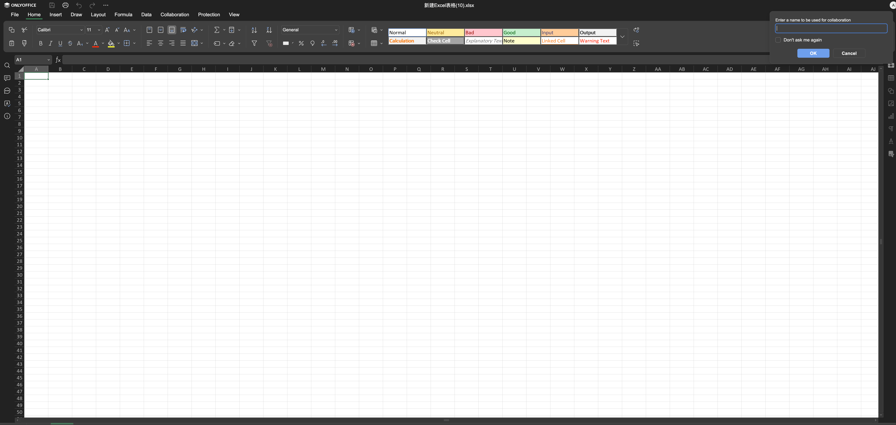

# 📊 ONLYOFFICE Personal

<div align="center">

[](LICENSE)
[](https://github.com/fernfei/OnlyofficePersonal/stargazers)
[](https://github.com/fernfei/OnlyofficePersonal/network)

**Local ONLYOFFICE Office Suite Based on WebAssembly**

🌐 **[Live Demo](https://fernfei.github.io/OnlyofficePersonal/office.html)** - Try it now without installation!

English | [中文](README.md)

</div>

## 📋 Introduction

ONLYOFFICE Personal is a completely local office suite solution that runs full ONLYOFFICE functionality in browsers based on x2t.wasm technology, without requiring any server-side support. This means you can process documents, spreadsheets, and presentations in a completely offline environment while protecting your data privacy.


## 🌟 Core Features

- **🔒 Fully Local** - No server required, all data processed locally, privacy protection guaranteed
- **⚡ Fast Response** - Based on WebAssembly technology with near-native performance
- **📝 Complete Functionality** - Supports all ONLYOFFICE office features including document editing, formula calculation, animation creation, etc.
- **📋 PDF Editing** - Powerful PDF editing capabilities with support for annotations, form filling, text modification and other professional operations
- **🌐 Cross-Platform** - Runs on any modern browser, supports Windows, macOS, Linux
- **📂 Format Compatible** - Perfect support for Microsoft Office formats (.docx, .xlsx, .pptx, etc.) and PDF format
- **🎨 User-Friendly Interface** - Familiar office software interface with low learning curve
- **💾 Ready to Use** - No installation required, runs directly in browser

## 🚀 Quick Start

### Requirements
- Modern browser (Chrome 80+, Firefox 80+, Safari 14+, Edge 80+)

### Installation Steps

1. **Clone the Project**
   ```bash
   git clone https://github.com/username/OnlyofficePersonal.git
   cd OnlyofficePersonal
   ```

2. **Start Local Server**
   ```bash
   python -m http.server 8000
   ```
   
3. **Access Application**
   Open [http://localhost:8000/office.html](http://localhost:8000/office.html) in your browser

### Alternative Launch Methods

Using Node.js:
```bash
npx http-server -p 8000
```

Using PHP:
```bash
php -S localhost:8000
```

## 💡 Usage Examples

### 📄 Document Editor (Word)
Supports rich text editing, style formatting, image insertion, tables, charts, and more.


### 📊 Spreadsheet (Excel)  
Provides powerful data processing capabilities including formula calculation, chart generation, pivot tables, etc.



### 🎯 Presentation (PowerPoint)
Create beautiful slideshows with animation effects, theme templates, multimedia insertion, and more.


### 📄 PDF Editor
Professional PDF editing capabilities with support for annotations, form filling, text modification, page management and other comprehensive PDF operations.


## 🔧 Technical Architecture

- **Frontend**: HTML5 + JavaScript + CSS3
- **Core Engine**: ONLYOFFICE Document Server (WebAssembly version)
- **File Processing**: x2t.wasm (document conversion engine)
- **Compatibility**: Supports WebAssembly features in mainstream browsers

## 📁 Project Structure

```
OnlyofficePersonal/
├── vendor/               # Third-party dependencies
│   ├── web-apps/         # Web application components
│   ├── sdkjs/            # JavaScript SDK
│   └── fonts/            # Font files
├── assets/               # Static resource files
├── docs/                 # Documentation and screenshots
├── office.html           # Main entry file
├── onlyoffice.html       # ONLYOFFICE entry file
└── README.md            # Project documentation
```

## 🤝 Contributing Guidelines

We welcome Issues and Pull Requests to improve the project:

1. Fork the project
2. Create a feature branch (`git checkout -b feature/AmazingFeature`)
3. Commit your changes (`git commit -m 'Add some AmazingFeature'`)
4. Push to the branch (`git push origin feature/AmazingFeature`)
5. Open a Pull Request

## 📄 License

This project is licensed under the AGPL-3.0 License - see the [LICENSE](LICENSE) file for details.

## 🙏 Acknowledgments

- [ONLYOFFICE](https://www.onlyoffice.com/) - For providing excellent office suite solutions
- [WebAssembly](https://webassembly.org/) - For making high-performance applications in browsers possible


---

<div align="center">

**⭐ If this project helps you, please give it a star!**

</div>
